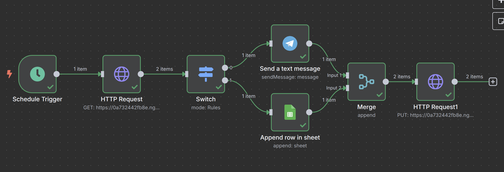

# Complaint-service
Система для обработки жалоб клиентов с использованием публичных API

## Установка зависимостей

1. Создайте виртуальное окружение:
```bash
python -m venv venv
source venv/bin/activate  # Linux/MacOS
venv\Scripts\activate     # Windows
```

2. Установите зависимости из requirements.txt:
```bash
pip install -r requirements.txt
```
## Подготовка n8n и модели в Google Colab(локальный вариант)

1. Перед запуском нужно загрузить модель Mistral-7B в Google Colab и создать там апи для взаимодействия с ней. Для этого нужно загрузить и выполнить в Colab блокнот `model.ipynb`. Для установки модели с Hugging Face нужно получить HF_TOKEN и сохранить его в секретах Colab. После выполнения последнего блока блокнота будет вывыдена ngrok-ссылка на публичный API модели, которую нужно запистаь в .env как `NGROK_URL`

2. Импортируйте в n8n файл `Complaint_workflow.json` и настройте каждый шаг со своими данными: ngrok-ссылки на API fastapi-сервера, API модели в Colab, Ссылки на таблицу в Google sheets и телеграм бота для отправки уведомлений



## Настройка переменных окружения

`API_LAYER_TOKEN` - Выдается при регистрации в [apilayer](https://apilayer.com/)
`HF_TOKEN` - выдается при регистрации в [hugging face](https://huggingface.co/)
`NGROK_TOKEN`=t1o2k3e4n5
`NGROK_URL` - ngrok-url, который выводится при создании сервера в последнем блоке кода `model.ipynb`

При настройке шага с телеграм-ботом в n8n нужно создать бота в телеграм с помощью @BotFather и загрузить в конфигурацию шага полученный токен

## Запуск приложения

1. Создайте файл `.env` в корне проекта. Необходимые настройки можно найти в `.env.example`:

2. Запустите сервер:
```bash
uvicorn app.main:app --port 8000 --reload
```

Будет выведена публичная ngrok-ссылка, по которой сервис будет доступен

## Примеры запросов

### Создание жалобы (POST)

#### cURL:
```bash
curl -X POST "http://127.0.0.1:8000/complaints/" \
-H "Content-Type: application/x-www-form-urlencoded" \
-d "text=I'm very disappointed with your service"
```

#### Postman:
1. Метод: POST
2. URL: http://127.0.0.1:8000/complaints/
3. Body:
   - Выберите `x-www-form-urlencoded`
   - Добавьте параметр:
     - Key: text
     - Value: I'm very disappointed with your service

#### Пример ответа:
```json
{
  "id": 1,
  "text": "I'm very disappointed with your service",
  "sentiment": "negative",
  "created_at": "2023-05-15T12:00:00",
  "status": "open",
  "category": "Другое"
}
```

### Получение списка жалоб (GET)

#### Postman:
1. Метод: GET
2. URL: http://127.0.0.1:8000/complaints/

#### Пример ответа:
```json
[
  {
    "id": 1,
    "text": "I liked this service",
    "sentiment": "positive",
    "date": "2023-05-15T12:00:00",
    "category": "Другое"
  },
  {
    "id": 2,
    "text": "I hate this service",
    "sentiment": "negative",
    "date": "2023-05-15T12:00:00",
    "category": "Оплата"
  },
]
```

## Дополнительная информация

Приложение автоматически определяет тональность текста жалобы с помощью API Layer Sentiment Analysis. В случае недоступности API или ошибки анализа, тональность устанавливается как "unknown".